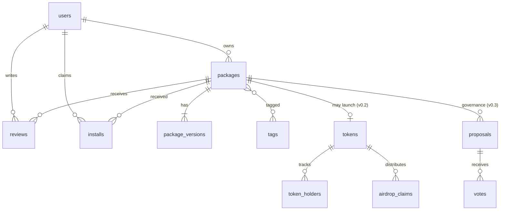

# 02 — 数据模型

## 1. 设计原则

- **三类 package 用统一表**：`packages.type` 区分 skill / agent / mcp_app；type-specific 字段塞 manifest（JSON）。避免上来就拆三套 schema。
- **包与版本分离**：`packages` 是元数据，`package_versions` 是真正的 manifest；查询 latest 走 `packages.latest_version_id` 指针，避免每次 join 求 max(version)。
- **评分有资格门槛**：`installs` 表是评分前置；`reviews` 唯一约束 `(package_id, user_id)`。
- **token 表延后**：v0.2 才加 `tokens` / `token_holders`；v0.1 schema 不预留以保持简洁，需要时 alembic 加。

---

## 2. v0.1 表

### `users`

| 列 | 类型 | 备注 |
|----|------|------|
| id | INTEGER PK | autoinc |
| handle | TEXT UNIQUE NOT NULL | 用户名，3-32 字符，`[a-z0-9-]` |
| email | TEXT UNIQUE | 可空（钱包登录可不填） |
| wallet_address | TEXT UNIQUE NOT NULL | 0x... 小写 |
| avatar_url | TEXT | |
| bio | TEXT | |
| created_at | DATETIME NOT NULL | UTC |
| updated_at | DATETIME NOT NULL | |

索引：`handle`, `wallet_address`。

### `packages`

| 列 | 类型 | 备注 |
|----|------|------|
| id | INTEGER PK | |
| slug | TEXT UNIQUE NOT NULL | URL-friendly，3-64 字符 |
| type | TEXT NOT NULL | `skill` / `agent` / `mcp_app` |
| owner_id | INTEGER FK users(id) | |
| latest_version_id | INTEGER FK package_versions(id) NULLABLE | 首次发布前为 NULL |
| status | TEXT NOT NULL | `draft` / `published` / `deprecated` / `removed` |
| title | TEXT NOT NULL | 显示名 |
| short_description | TEXT NOT NULL | 列表卡片用，≤ 140 字 |
| install_count | INTEGER NOT NULL DEFAULT 0 | 累计安装凭证签发数 |
| rating_avg | REAL NOT NULL DEFAULT 0 | 评分均值；后台异步更新 |
| rating_count | INTEGER NOT NULL DEFAULT 0 | |
| created_at | DATETIME NOT NULL | |
| updated_at | DATETIME NOT NULL | |

索引：`slug`, `type`, `status`, `owner_id`, `(type, rating_avg DESC)`（榜单）。

### `package_versions`

| 列 | 类型 | 备注 |
|----|------|------|
| id | INTEGER PK | |
| package_id | INTEGER FK packages(id) NOT NULL | |
| version | TEXT NOT NULL | semver，如 `1.2.3` |
| manifest | TEXT NOT NULL | JSON，详见 04-package-format.md |
| asset_url | TEXT | 主资产 URL（skill 的 .md / mcp_app 的 zip） |
| readme | TEXT | markdown 文本 |
| changelog | TEXT | markdown |
| published_at | DATETIME NOT NULL | |
| published_by | INTEGER FK users(id) | |

索引：`(package_id, version)` UNIQUE。

### `tags`

| 列 | 类型 | 备注 |
|----|------|------|
| id | INTEGER PK | |
| name | TEXT UNIQUE NOT NULL | `[a-z0-9-]`, 2-24 字符 |
| description | TEXT | |
| package_count | INTEGER NOT NULL DEFAULT 0 | 缓存 |

### `package_tags`（多对多）

| 列 | 类型 | 备注 |
|----|------|------|
| package_id | INTEGER FK packages(id) | |
| tag_id | INTEGER FK tags(id) | |

PK：`(package_id, tag_id)`。

### `installs`

| 列 | 类型 | 备注 |
|----|------|------|
| id | INTEGER PK | |
| package_id | INTEGER FK packages(id) NOT NULL | |
| user_id | INTEGER FK users(id) NOT NULL | |
| version_id | INTEGER FK package_versions(id) NOT NULL | 当时的 latest |
| receipt_sig | TEXT NOT NULL | HMAC，前端可向后端核验 |
| installed_at | DATETIME NOT NULL | |

索引：`(package_id, user_id)` UNIQUE（一人对一包只签发一次）；`user_id`。

### `reviews`

| 列 | 类型 | 备注 |
|----|------|------|
| id | INTEGER PK | |
| package_id | INTEGER FK packages(id) NOT NULL | |
| user_id | INTEGER FK users(id) NOT NULL | |
| version_id | INTEGER FK package_versions(id) | 评的那一版 |
| rating | INTEGER NOT NULL | 1-5 |
| body | TEXT | markdown，≤ 4000 字 |
| created_at | DATETIME NOT NULL | |
| updated_at | DATETIME NOT NULL | |
| edit_count | INTEGER NOT NULL DEFAULT 0 | 改一次后计数；建议上限 1 |

索引：`(package_id, user_id)` UNIQUE；`(package_id, created_at DESC)`（详情页倒序）。

### `auth_nonces`（可放 Redis，列出供完整性）

| 列 | 类型 | 备注 |
|----|------|------|
| address | TEXT PK | 0x... 小写 |
| nonce | TEXT NOT NULL | 16 字节 hex |
| issued_at | DATETIME NOT NULL | |
| expires_at | DATETIME NOT NULL | issued_at + 5min |

实现走 Redis，key = `auth:nonce:{address}`，TTL 300s。

---

## 3. v0.2 追加表

### `tokens`

| 列 | 类型 | 备注 |
|----|------|------|
| package_id | INTEGER PK FK packages(id) | 一包一币 |
| chain_id | INTEGER NOT NULL | Sepolia = 11155111 |
| contract_address | TEXT NOT NULL | 0x... 小写 |
| name | TEXT NOT NULL | 例 `tAGM AwesomeRustSkill` |
| symbol | TEXT NOT NULL | 例 `tAGM-ARS` |
| total_supply | NUMERIC(78,0) NOT NULL | 1,000,000 \* 10^18 |
| author_vesting_address | TEXT | vesting 合约地址 |
| airdrop_address | TEXT | 空投合约地址 |
| treasury_address | TEXT | 平台金库地址 |
| deployed_at | DATETIME NOT NULL | |
| deployed_tx | TEXT NOT NULL | tx hash |

### `token_holders`

| 列 | 类型 | 备注 |
|----|------|------|
| id | INTEGER PK | |
| package_id | INTEGER FK tokens(package_id) | |
| wallet | TEXT NOT NULL | 0x... 小写 |
| balance | NUMERIC(78,0) NOT NULL | wei |
| snapshot_at | DATETIME NOT NULL | 索引器最近一次更新时间 |

索引：`(package_id, balance DESC)`（榜单）；`(wallet, package_id)` UNIQUE。
索引器消费 `Transfer` 事件增量更新；用户可手动触发 refresh。

### `airdrop_claims`

| 列 | 类型 | 备注 |
|----|------|------|
| id | INTEGER PK | |
| package_id | INTEGER FK | |
| user_id | INTEGER FK users(id) | |
| amount | NUMERIC(78,0) NOT NULL | wei |
| reason | TEXT | `early_reviewer` / `early_installer` / `bug_fix` |
| claim_proof | TEXT | merkle proof |
| claimed_at | DATETIME | NULL = 未领取 |

索引：`(package_id, user_id)`。

---

## 4. v0.3 追加（治理）

### `proposals`

| 列 | 类型 | 备注 |
|----|------|------|
| id | INTEGER PK | |
| package_id | INTEGER FK packages(id) | |
| title | TEXT NOT NULL | |
| body | TEXT NOT NULL | markdown |
| created_by | INTEGER FK users(id) | |
| voting_starts_at | DATETIME NOT NULL | |
| voting_ends_at | DATETIME NOT NULL | |
| status | TEXT NOT NULL | `pending` / `active` / `passed` / `rejected` / `executed` |

### `votes`

| 列 | 类型 | 备注 |
|----|------|------|
| id | INTEGER PK | |
| proposal_id | INTEGER FK | |
| voter | TEXT NOT NULL | 钱包地址 |
| weight | NUMERIC(78,0) NOT NULL | 投票时 token 余额（snapshot） |
| choice | TEXT NOT NULL | `for` / `against` / `abstain` |
| voted_at | DATETIME NOT NULL | |

索引：`(proposal_id, voter)` UNIQUE。

---

## 5. ER 关系图（mermaid）

---

## 6. 迁移策略

- v0.1 用 alembic 一次性拉起所有 v0.1 表
- v0.2 → 新增 `tokens` / `token_holders` / `airdrop_claims`
- v0.3 → 新增 `proposals` / `votes`
- v0.5 SQLite → Postgres：用 [pgloader](https://github.com/dimitri/pgloader) 一键迁移；同时把 FTS5 替换为 Postgres trigram 索引（详见 03-api-spec.md 搜索部分）

---

## 7. 数据规模估算（v0.1 末期）

| 表 | 行数估计 | 大小 |
|----|---------|------|
| users | 5 K | < 1 MB |
| packages | 500 | < 1 MB |
| package_versions | 2 K | manifest 各 2 KB → 4 MB |
| reviews | 3 K | 各 1 KB → 3 MB |
| installs | 50 K | < 5 MB |

总量 < 100 MB，SQLite 完全 hold 得住。
